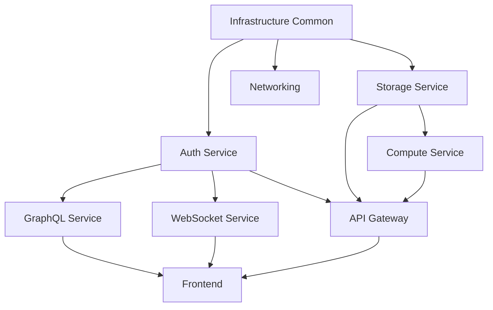

# Monorepo to Microservices Migration Guide

## Overview

This guide outlines the strategy to break the AnyCompany CRM monorepo into 9 separate microservices repositories with proper separation of concerns.

## Target Repository Structure

> The below work has been started at https://gitlab.aws.dev/demo-repos-genai-labs

### 1. `crm-frontend` - Web Application
**Purpose**: React-based CRM user interface

**Contents**:
- `lib/stacks/frontend/app/` → Root
- `lib/stacks/frontend/index.ts` → `infrastructure/`
- Frontend-specific CDK constructs

**Dependencies**:
- Consumes: Auth Service (Cognito), API Gateway, GraphQL Service, Storage Service
- Package: `@anycompany/crm-frontend`

**Key Files**:
```
crm-frontend/
├── src/                    # React app
├── infrastructure/         # CDK for CloudFront + S3
├── package.json
└── README.md
```

---

### 2. `crm-auth-service` - Authentication & Authorization
**Purpose**: Centralized authentication using Amazon Cognito

**Contents**:
- `lib/stacks/backend/auth.ts` → `infrastructure/auth.ts`
- WAF rules
- User pool configuration

**Exports**:
- User Pool ID
- User Pool Client ID
- Identity Pool ID
- Cognito Domain URL

**Key Files**:
```
crm-auth-service/
├── infrastructure/
│   ├── auth.ts
│   └── waf.ts
├── package.json
└── README.md
```

---

### 3. `crm-api-gateway` - REST API Gateway
**Purpose**: REST API endpoints and routing

**Contents**:
- `lib/stacks/backend/rest-api/` → Root
- Lambda functions for REST endpoints
- API Gateway configuration

**Dependencies**:
- Requires: Auth Service, Storage Service, Compute Service
- Package: `@anycompany/crm-api-gateway`

**Key Files**:
```
crm-api-gateway/
├── src/
│   ├── handlers/          # Lambda functions
│   └── middleware/
├── infrastructure/
│   └── api-gateway.ts
├── package.json
└── README.md
```

---

### 4. `crm-graphql-service` - GraphQL API
**Purpose**: AppSync GraphQL API for data operations

**Contents**:
- `lib/stacks/backend/graph-api/` → Root
- GraphQL schema
- Resolvers
- DynamoDB tables for GraphQL data

**Dependencies**:
- Requires: Auth Service, Infrastructure Common (VPC)
- Package: `@anycompany/crm-graphql-service`

**Key Files**:
```
crm-graphql-service/
├── schema/
│   └── schema.graphql
├── resolvers/
├── infrastructure/
│   ├── appsync.ts
│   └── dynamodb.ts
├── package.json
└── README.md
```

---

### 5. `crm-storage-service` - Storage Management
**Purpose**: S3 buckets and data storage

**Contents**:
- `lib/stacks/backend/storage/` → Root
- S3 bucket configurations
- DynamoDB tables
- CloudFront distribution for images

**Exports**:
- Storage bucket names
- Image delivery domain
- DynamoDB table names

**Key Files**:
```
crm-storage-service/
├── infrastructure/
│   ├── s3.ts
│   ├── dynamodb.ts
│   └── cloudfront.ts
├── package.json
└── README.md
```

---

### 6. `crm-compute-service` - Compute & Processing
**Purpose**: Background processing and compute workloads

**Contents**:
- `lib/stacks/backend/compute/` → Root
- EC2 instances for image processing
- SQS queues
- Lambda functions for async tasks

**Dependencies**:
- Requires: Storage Service, Infrastructure Common (VPC)
- Package: `@anycompany/crm-compute-service`

**Key Files**:
```
crm-compute-service/
├── src/
│   ├── processors/
│   └── workers/
├── infrastructure/
│   ├── ec2.ts
│   ├── sqs.ts
│   └── lambda.ts
├── package.json
└── README.md
```

---

### 7. `crm-websocket-service` - Real-time Communication
**Purpose**: WebSocket API for real-time updates

**Contents**:
- `lib/stacks/backend/websocket-api/` → Root
- WebSocket API Gateway
- Connection management Lambda functions

**Dependencies**:
- Requires: Auth Service, Infrastructure Common (VPC)
- Package: `@anycompany/crm-websocket-service`

**Key Files**:
```
crm-websocket-service/
├── src/
│   ├── handlers/
│   │   ├── connect.ts
│   │   ├── disconnect.ts
│   │   └── default.ts
│   └── connection-manager/
├── infrastructure/
│   └── websocket-api.ts
├── package.json
└── README.md
```

---

### 8. `crm-infrastructure-common` - Shared Infrastructure
**Purpose**: Shared CDK constructs and networking

**Contents**:
- `lib/common/` → Root
- `lib/stacks/backend/networking.ts` → `networking/`
- Reusable CDK constructs

**Exports**:
- VPC
- Security Groups
- Common constructs (S3, Lambda, Stack utilities)

**Key Files**:
```
crm-infrastructure-common/
├── constructs/
│   ├── s3.ts
│   ├── lambda.ts
│   ├── stack.ts
│   └── static-website/
├── networking/
│   └── vpc.ts
├── aspects.ts
├── utilities.ts
├── package.json
└── README.md
```

---

### 9. `crm-tools` - Tooling & Scripts
**Purpose**: Development tools and utilities

**Contents**:
- `tools/` → Root
- Image generation scripts
- CLI utilities
- Development helpers

**Key Files**:
```
crm-tools/
├── generate-crm-assets.sh
├── generate-sales-avatars.py
├── generate-company-logos.py
├── cli.ts
├── package.json
└── README.md
```

---

## Migration Steps

### Phase 1: Preparation (Week 1)

1. **Create New Repositories**
   ```bash
   # Create all 9 repositories in GitHub/GitLab
   gh repo create anycompany/crm-frontend --private
   gh repo create anycompany/crm-auth-service --private
   gh repo create anycompany/crm-api-gateway --private
   gh repo create anycompany/crm-graphql-service --private
   gh repo create anycompany/crm-storage-service --private
   gh repo create anycompany/crm-compute-service --private
   gh repo create anycompany/crm-websocket-service --private
   gh repo create anycompany/crm-infrastructure-common --private
   gh repo create anycompany/crm-tools --private
   ```

2. **Set Up Package Registry**
   - Configure npm private registry or GitHub Packages
   - Set up authentication for package publishing

3. **Document Dependencies**
   - Map all inter-service dependencies
   - Create dependency graph

### Phase 2: Extract Infrastructure Common (Week 2)

**Why First?** All other services depend on common constructs.

```bash
# 1. Clone infrastructure-common repo
git clone git@github.com:anycompany/crm-infrastructure-common.git
cd crm-infrastructure-common

# 2. Copy common files
cp -r ../superagents-demo/lib/common/* ./
cp ../superagents-demo/lib/stacks/backend/networking.ts ./networking/

# 3. Create package.json
npm init -y
npm install aws-cdk-lib constructs

# 4. Publish to registry
npm version 1.0.0
npm publish
```

### Phase 3: Extract Backend Services (Weeks 3-4)

Extract in dependency order:

1. **Auth Service** (no dependencies)
2. **Storage Service** (depends on common)
3. **Compute Service** (depends on storage, common)
4. **GraphQL Service** (depends on auth, common)
5. **WebSocket Service** (depends on auth, common)
6. **API Gateway** (depends on auth, storage, compute)

**Example: Auth Service**
```bash
cd crm-auth-service
mkdir -p infrastructure

# Copy auth files
cp ../superagents-demo/lib/stacks/backend/auth.ts ./infrastructure/

# Update imports
# Change: import { CommonStack } from "../../common/constructs/stack";
# To: import { CommonStack } from "@anycompany/crm-infrastructure-common";

# Install dependencies
npm install @anycompany/crm-infrastructure-common aws-cdk-lib

# Create CDK app
cat > bin/app.ts << 'EOF'
import * as cdk from 'aws-cdk-lib';
import { Auth } from '../infrastructure/auth';

const app = new cdk.App();
new Auth(app, 'crm-auth-service', {
  env: {
    account: process.env.CDK_DEFAULT_ACCOUNT,
    region: process.env.CDK_DEFAULT_REGION,
  },
});
EOF

# Deploy
npm run cdk deploy
```

### Phase 4: Extract Frontend (Week 5)

```bash
cd crm-frontend

# Copy frontend app
cp -r ../superagents-demo/lib/stacks/frontend/app/* ./

# Copy infrastructure
mkdir infrastructure
cp ../superagents-demo/lib/stacks/frontend/index.ts ./infrastructure/

# Update environment variables to use SSM parameters or secrets
# pointing to deployed backend services

# Install dependencies
npm install

# Deploy
npm run cdk deploy
```

### Phase 5: Extract Tools (Week 6)

```bash
cd crm-tools
cp -r ../superagents-demo/tools/* ./
npm install
```

### Phase 6: Integration & Testing (Weeks 7-8)

1. **Service Discovery**
   - Use AWS Systems Manager Parameter Store for service endpoints
   - Or AWS App Mesh for service mesh

2. **Update Environment Variables**
   ```typescript
   // Instead of direct references, use SSM parameters
   const userPoolId = ssm.StringParameter.valueFromLookup(
     this, '/crm/auth/user-pool-id'
   );
   ```

3. **Cross-Stack References**
   ```typescript
   // Export from Auth Service
   new cdk.CfnOutput(this, 'UserPoolId', {
     value: userPool.userPoolId,
     exportName: 'crm-auth-user-pool-id',
   });

   // Import in API Gateway
   const userPoolId = cdk.Fn.importValue('crm-auth-user-pool-id');
   ```

4. **End-to-End Testing**
   - Deploy all services
   - Test integration points
   - Verify data flow

---

## Dependency Management

### Option 1: NPM Packages (Recommended)

**Pros**: Version control, semantic versioning, easy updates
**Cons**: Requires package registry

```json
{
  "dependencies": {
    "@anycompany/crm-infrastructure-common": "^1.0.0",
    "@anycompany/crm-auth-service": "^1.0.0"
  }
}
```

### Option 2: CloudFormation Exports

**Pros**: Native AWS, no external dependencies
**Cons**: Regional, can't delete exports while in use

```typescript
// Export
new CfnOutput(this, 'VpcId', {
  value: vpc.vpcId,
  exportName: 'crm-vpc-id',
});

// Import
const vpcId = Fn.importValue('crm-vpc-id');
```

### Option 3: SSM Parameter Store

**Pros**: Flexible, cross-region, versioned
**Cons**: Additional API calls

```typescript
// Store
new ssm.StringParameter(this, 'VpcIdParam', {
  parameterName: '/crm/networking/vpc-id',
  stringValue: vpc.vpcId,
});

// Retrieve
const vpcId = ssm.StringParameter.valueFromLookup(
  this, '/crm/networking/vpc-id'
);
```

---

## CI/CD Strategy

### Deployment Order



### GitHub Actions Workflow

```yaml
# .github/workflows/deploy.yml
name: Deploy Microservices

on:
  push:
    branches: [main]

jobs:
  deploy-common:
    runs-on: ubuntu-latest
    steps:
      - uses: actions/checkout@v3
      - name: Deploy Infrastructure Common
        run: |
          cd crm-infrastructure-common
          npm install
          npm run cdk deploy

  deploy-auth:
    needs: deploy-common
    runs-on: ubuntu-latest
    steps:
      - name: Deploy Auth Service
        run: |
          cd crm-auth-service
          npm install
          npm run cdk deploy

  # ... repeat for other services
```

---

## Communication Patterns

### Synchronous (Request/Response)
- **Frontend → API Gateway**: REST API
- **Frontend → GraphQL Service**: GraphQL queries/mutations
- **API Gateway → Other Services**: Direct Lambda invocation or HTTP

### Asynchronous (Event-Driven)
- **Service → Service**: SNS/SQS
- **Real-time Updates**: WebSocket API
- **Background Jobs**: SQS + Lambda

### Example: Event-Driven Architecture

```typescript
// In Storage Service - publish event
const topic = new sns.Topic(this, 'ImageUploadedTopic');

// In Compute Service - subscribe to event
topic.addSubscription(new subs.SqsSubscription(imageProcessingQueue));
```

---

## Monitoring & Observability

### Distributed Tracing
- Enable AWS X-Ray across all services
- Use correlation IDs for request tracking

### Centralized Logging
- CloudWatch Logs with log groups per service
- Use CloudWatch Insights for cross-service queries

### Metrics & Alarms
- Service-specific dashboards
- Cross-service health checks
- SLA monitoring

---

## Cost Considerations

### Before (Monorepo)
- Single deployment pipeline
- Shared resources
- **Estimated**: $70-280/month

### After (Microservices)
- 9 separate pipelines
- Potential resource duplication
- Additional NAT Gateways, VPC endpoints
- **Estimated**: $150-500/month

### Cost Optimization
- Share VPC across services (Infrastructure Common)
- Use VPC endpoints instead of NAT Gateways where possible
- Implement resource tagging for cost allocation
- Consider AWS Organizations for consolidated billing

---

## Rollback Strategy

### Per-Service Rollback
```bash
# Rollback specific service
cd crm-api-gateway
npm run cdk deploy --rollback
```

### Full System Rollback
- Tag all deployments with version
- Keep previous CloudFormation stacks
- Use blue/green deployment for frontend

---

## Security Considerations

### Service-to-Service Authentication
- Use IAM roles for Lambda-to-Lambda
- API keys for external services
- VPC security groups for network isolation

### Secrets Management
- AWS Secrets Manager for credentials
- SSM Parameter Store for configuration
- Never hardcode secrets

### Network Security
- Private subnets for backend services
- Security groups with least privilege
- VPC endpoints for AWS services

---

## Testing Strategy

### Unit Tests
- Test each service independently
- Mock external dependencies

### Integration Tests
- Test service-to-service communication
- Use LocalStack for local testing

### End-to-End Tests
- Deploy to staging environment
- Test complete user flows
- Automated with Cypress or Playwright

---

## Documentation Requirements

Each repository should include:

1. **README.md**
   - Service purpose
   - Architecture diagram
   - Setup instructions
   - API documentation

2. **CONTRIBUTING.md**
   - Development workflow
   - Code standards
   - PR process

3. **CHANGELOG.md**
   - Version history
   - Breaking changes
   - Migration guides

4. **API.md** (for services with APIs)
   - Endpoint documentation
   - Request/response examples
   - Authentication requirements

---

## Timeline Summary

| Phase | Duration | Deliverable |
|-------|----------|-------------|
| Preparation | Week 1 | Repos created, dependencies mapped |
| Infrastructure Common | Week 2 | Published package |
| Backend Services | Weeks 3-4 | 6 services deployed |
| Frontend | Week 5 | Frontend deployed |
| Tools | Week 6 | Tools extracted |
| Integration & Testing | Weeks 7-8 | Full system tested |

**Total**: 8 weeks

---

## Success Criteria

- ✅ All services deploy independently
- ✅ Frontend can communicate with all backend services
- ✅ No shared code outside of published packages
- ✅ CI/CD pipelines working for each repo
- ✅ Monitoring and logging in place
- ✅ Documentation complete
- ✅ Team trained on new architecture

---

## Next Steps

1. **Review this plan** with your team
2. **Adjust timeline** based on team capacity
3. **Set up repositories** and package registry
4. **Start with Infrastructure Common** extraction
5. **Iterate and improve** based on learnings

---

## Questions to Consider

1. **Do you need all services separated?** Some services might be better together (e.g., Auth + API Gateway)
2. **What's your deployment frequency?** Microservices shine with frequent, independent deployments
3. **Team structure?** Ideally, each service has a dedicated team
4. **Complexity vs. benefits?** Microservices add operational complexity

---

## Alternative: Modular Monolith

If full microservices seem too complex, consider a **modular monolith**:

```
superagents-demo/
├── modules/
│   ├── auth/
│   ├── api-gateway/
│   ├── graphql/
│   └── storage/
├── shared/
│   └── common/
└── apps/
    └── frontend/
```

**Pros**: 
- Easier to manage
- Simpler deployment
- Lower operational overhead

**Cons**:
- Tighter coupling
- Harder to scale independently
- Larger blast radius for failures

---

## Conclusion

Breaking a monorepo into microservices is a significant undertaking. Ensure the benefits (independent deployment, team autonomy, technology flexibility) outweigh the costs (operational complexity, distributed system challenges, increased infrastructure costs).

**Recommendation**: Start with Infrastructure Common and 2-3 core services, validate the approach, then expand.
