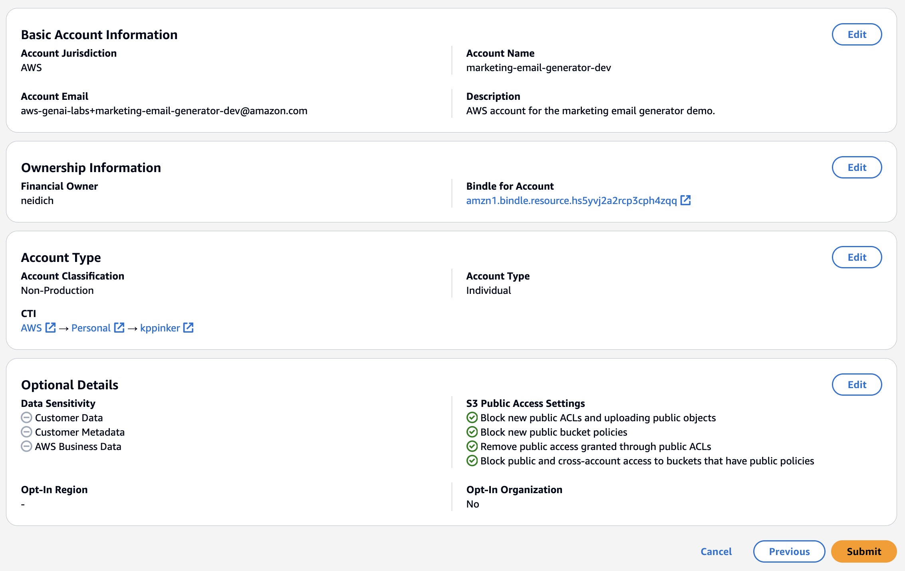
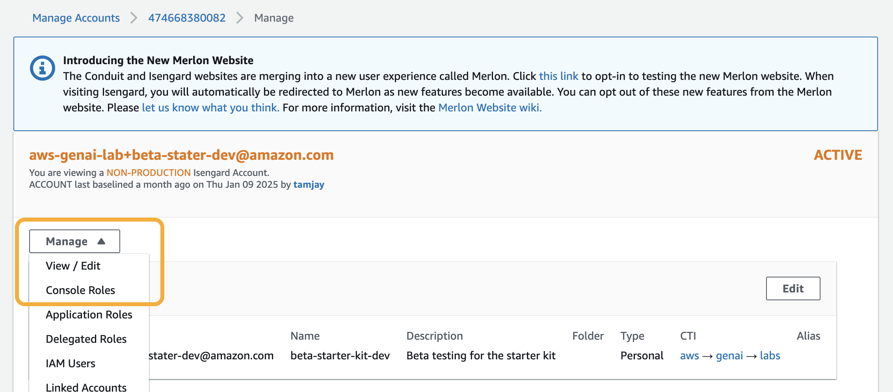
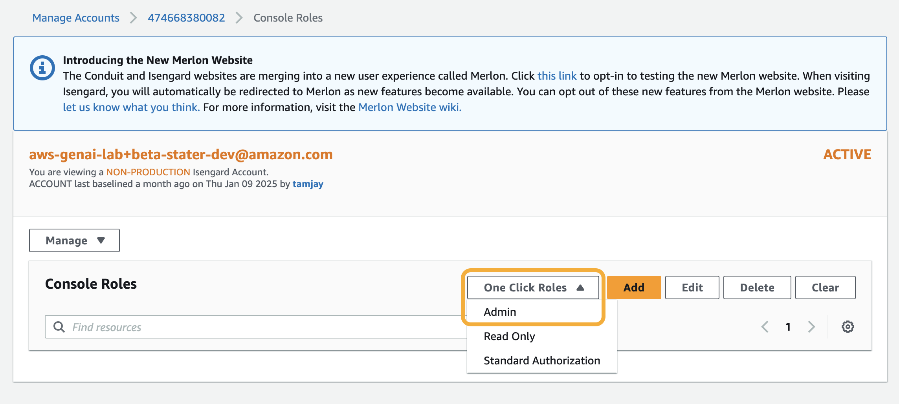
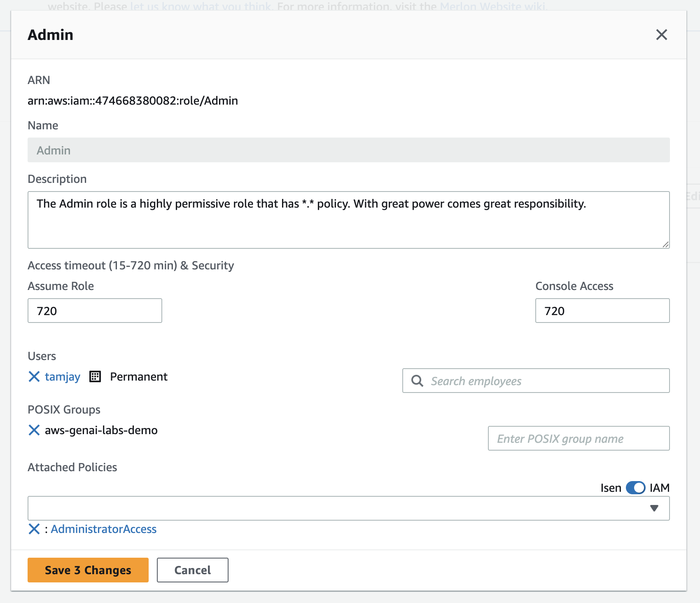

<!-- @export {"deleteFile": true} -->

# Isengard Account Creation

1. Navigate to [Merlon](https://iad.merlon.amazon.dev/create-account/aws).
2. Under **Business Accountability**, ensure the **AWS (Isengard)** option is selected.
3. Enter an **Account Name** using the following format `[DEMO_NAME]-[STAGE]`.
    - Ex: `marketing-email-generator-prod` or `marketing-email-generator-kppinker`
4. Enter an **Account Email** using the following format `[EMAIL]+[DEMO_NAME]-[STAGE]@amazon.com`.
    - If you are on the core Technical Product Marketing team, use the `aws-genai-labs` email. Otherwise, you may use another email.
    - Ex: `aws-genai-labs+marketing-email-generator-prod@amazon.com`
    * Adding a `+` qualifier to your email will create a unique email address for each new demo.
5. Enter a short **Account Description** for your demo then click **Next**.
6. Under **Bindle For Account**, search for then select your team or personal bindle.
    - You may need to [create a personal bindle](./bindle-creation.md#bindle) if you do not have a bindle to select.
    - If you are on the core Technical Product Marketing team, select `AWS-GenAI-Labs-Demo` (this should refer to the bindle ID `amzn1.bindle.resource.hs5yvj2a2rcp3cph4zqq`).
7. Click **Next**. Leave the **Account Classification** as **Non-Production** and **Account Type** as **Individual**.
    - Even if this is a "prod" account, marking it as such will require [additional overhead and approvals](https://w.amazon.com/bin/view/AWS_IT_Security/Isengard/Using_Isengard/Manage_AWS_Accounts/Account_Creation/#HWhatisthedifferencebetweenProductionvsNon-Productionaccounts3F).
8. Under **Owning CTI**, select your personal CTI properties.
    - You will need to [create a personal CTI](./bindle-creation.md#cti-and-resolver-group) if you do not have one already.
9. Click **Next**. On the **Optional Details** page, leave all the boxes unchecked then click **Next** again.
10. Verify the final **Review and Submit** page then click **Submit**.

    
    - Account creation may take a few minutes.

11. Once your account is created, navigate to the [Isengard manage accounts dashboard](https://isengard.amazon.com/manage-accounts) then search for and click on the account.
12. Click the **Manage** dropdown then select **Console Roles**.

    

13. Click the **One Click Roles** dropdown then select **Admin**.

    

14. Select the **Admin** role card you just created then click **Edit**.
15. Enter the following parameters:

    **Assume Role**: `720`

    **Console Access**: `720`

    **POSIX Groups**: `aws-genai-labs-demo`

16. Optionally, you can add other team members to this role by entering their alias in **Search employees**.

    

17. Click **Save X Changes**.

18. Optionally, create a **Read Only** role from the **One Click Roles** dropdown with the same parameters above.
