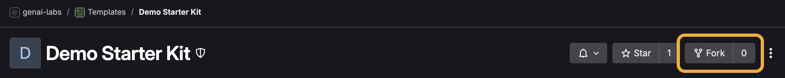
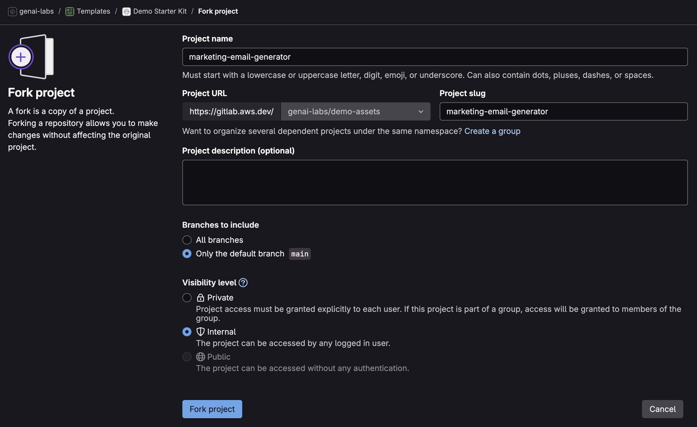
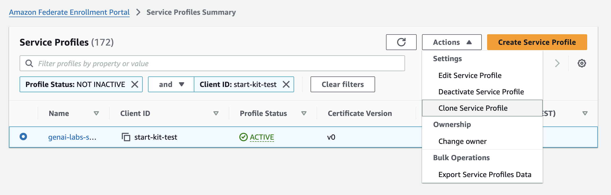

<!-- @export {"deleteFile": true} -->

# Demo Creation

These instructions will walk you through creating a brand new demo. This is a one-time process for each demo.

[TOC]

## AWS Account(s)

1. Have at least one AWS account with access to its **Admin** console role.
    - A separate staging and prod account are optional, but encouraged.
    - Follow these [instructions](./account-creation.md) to create a brand new Isengard account or add an admin role if needed.

## GitLab Repository

### Fork It

2. Navigate to the Demo Starter Kit [GitLab page](https://gitlab.aws.dev/genai-labs/templates/demo-starter-kit) then click **Fork**.

    

3. Enter a **Project name** using the following format `[DEMO_NAME]` and ensure the **Project slug** updates accordingly.
    - Ex: `marketing-email-generator`
4. Under **Project URL**, **select a namespace**.
    - If you are on the core Technical Product Marketing team, select `genai-labs/demo-assets`. Otherwise, you may use your alias or another namespace.
5. Enter your demo name for the **Project description**.
6. Under **Branches to include**, select **Only the default branch `main`**.
7. Under **Visibility level**, select the **Internal** option.

    

8. Click **Fork project**.
9. From your demo's new GitLab page, click **Settings** then **Merge requests**.
10. Under **Target project**, select **This project**, then click **Save changes**.

### Clone It

11. From your demo's new GitLab page, click the **Code** dropdown and click the copy icon to copy the SSH URL.

    

12. Open a terminal then navigate to the directory where you want to clone the files by running the command `cd [new directory]`.
13. To clone the files, run the command `git clone [copied URL]`.
    - Git automatically creates a folder with the repository name and downloads the files there.

## Configuration Files

14. Open the project folder in your IDE of choice then open [`cdk.json`](../../cdk.json).
    - The starter kit uses `cdk.json` to centrally track and manage CDK configurations.
        - See the [kit documentation](./kit.md#configuration-file) for more details.
15. Update **projectId** with a unique identifier less than 15 characters that best reflects your project name.
    - Use a shorthand name separated by a `-`. Do not use any other special characters such as `! , & * @ # < > ?`.
    - Ex: `email-generator`
16. Update the **accounts** configuration with your accounts from [step 1](#aws-accounts).
    - You must provide the account **ID** and **region**.
    - If you are on the core Technical Product Marketing team, set **midway** to `true` to enable Midway authentication for that account.
    - Set **prod** to `true` to mark that account for production.
17. **Save** `cdk.json`.
18. Open [`package.json`](../../package.json) then edit the following:

    **name**: Type the project identifier you provided in step 15.

    **description**: Type the demo name you provided in [step 5](#fork-it).

19. **Save** `package.json`.

## [Federate](https://ep.federate.a2z.com/help/FAQ#what-is-amazon-federate) Profile(s)

If you are on the core Technical Product Marketing team and enabled Midway for an account in the [`cdk.json` file](../../cdk.json), please continue. Otherwise you may skip to the [next section](#configuration-commands).

### Integration Profile

20. Navigate to the Federate [Integration](https://integ.ep.federate.a2z.com/profiles) profiles.
21. Search for then select the profile named `start-kit-test`.
22. After selecting the profile, click the **Actions** dropdown then click **Clone Service Profile**.

    

23. Enter a **Service Name** that exactly matches the **projectId** in your [`cdk.json` file](../../cdk.json).
    - Ex: `email-generator`
24. Check the box titled **Unfabric guidelines**.
25. Check the box titled **Integ Environment restrictions**.
26. Leave all other options at their defaults and click **Next**.
27. Enter a **Client ID** that exactly matches the **Service Name** and **projectId**.
28. Enter **Redirect URIs** using the following format `https://[STAGE]-[PROJECT_IDENTIFIER].auth.[ACCOUNT_REGION].amazoncognito.com/oauth2/idpresponse`.
    - The stage, project identifier, and region should reflect the non-prod account(s) in your [`cdk.json` file](../../cdk.json).
    - If you are configuring multiple accounts, then you need to add URI(s) on a new line.
    - Ex:

    ```
    https://staging-email-generator.auth.us-west-2.amazoncognito.com/oauth2/idpresponse
    https://kppinker-email-generator.auth.us-west-2.amazoncognito.com/oauth2/idpresponse
    ```

29. Turn the **Client Secret** switch on then click **Next**.

    

30. On the **Discovery and Permissions Configuration** page, select **The application is a company-wide collaboration tool** then click **Next**.
31. Skip over the **Claim Configuration** page by clicking **Next** again.
32. On the **Service Profile Overview** page, click **Submit**.
33. Copy the generated client secret key.
    > [I lost the Federate client secret key. Now what?](./federate-key-recovery.md)
34. The Integration profile expires after 30 days. Set a recurring calendar invite to renew it.
    - Follow these [instructions](./federate-profile-renewal.md) to renew it.

### Production Profile

If you marked an account for production in the [`cdk.json` file](../../cdk.json), please continue. Otherwise you may skip to the [next section](#configuration-commands).

35. Navigate to the [Production](https://ep.federate.a2z.com/drafts) drafts.
36. Click **Import from Integ**.
37. Enter the **client ID** you provided in [step 27](#integration-profile).
38. Check the box titled **Unfabric guidelines** then click **Next**.
39. Update the **Redirect URI** for the prod account using the following format `https://[STAGE]-[PROJECT_IDENTIFIER].auth.[ACCOUNT_REGION].amazoncognito.com/oauth2/idpresponse`.
    - The stage, project identifier, and region should reflect the prod account in your [`cdk.json` file](../../cdk.json).
    - Ex:

    ```
    https://prod-email-generator.auth.us-west-2.amazoncognito.com/oauth2/idpresponse
    ```

40. Turn the **Client Secret** switch on then click **Next**.
41. On the **Discovery and Permissions Configuration** page, select **The application is a company-wide collaboration tool** then click **Next**.
42. Skip over the **Claim Configuration** page by clicking **Next** again.
43. On the **Service Profile Overview** page, click **Submit** then copy the generated client secret key and provide it to your fellow builders.
    > [I lost the Federate client secret key. Now what?](./federate-key-recovery.md)

## Configuration Commands

44. To install the starter kit/project dependencies, open a terminal at the root directory then run the command `npm install`.
45. To configure the demo, we will use the kit CLI. Run the command `npm run kit`.
    - See the [kit documentation](./kit.md#kit-cli) to learn more about the Demo Starter Kit CLI.
46. Select an account then authenticate with your preferred method.
47. After authenticating, select **Bootstrap Account**.
48. If you enabled Midway for the account, select **Configure Secret** then enter `federateSecret` followed by the appropriate Federate client secret key from the [previous section](#federate-profiles).
    - If Midway is not enabled, you can select **Manage Cognito User** then **Create User** to get a login.
49. Select **Back**, then repeat steps 46-48 for other accounts if applicable.

## Code Deployment

50. Select **Back** then the account into which you would like to deploy the infrastructure.
51. Select **Deploy CDK Stack(s)**.
52. Once the deployment finishes, find the output titled **URL**. Visit that URL to see your frontend React app.

    

## Code Check-In

53. From the root directory, run the command `git add -A && npm run commit`.
54. For **Select the type of change that you're committing**, select **chore**.
55. For **What is the scope of this change**, enter `app`.
56. For **Write a short, imperative tense description of the change**, enter `initial code commit`.
57. For **Provide a longer description of the change**, press **Enter** to skip.
58. For **Are there any breaking changes?** press **Enter** to indicate **N**.

59. If the commit hooks powered by Husky fail, you will need to repeat steps 53-58.
    - See the [kit documentation](./kit.md#hooks) to learn more about the commit hooks.
60. If the commit hooks succeed, you can push the committed files to your repository with the command `git push origin main`.

🎉 Congratulations! You have successfully created your brand new demo!
