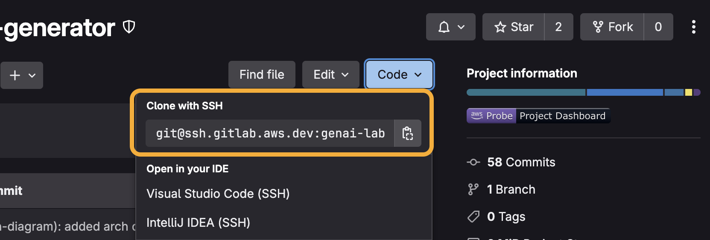

<!-- @export {"deleteFile": true} -->

# Demo Setup

These instructions will walk you through setting up a demo, assuming your demo has already been [created](./demo-creation.md) and you are looking to set up the project.

[TOC]

## AWS Account

1. Have at least one AWS account with access to its **Admin** console role.
    - Follow these [instructions](./account-creation.md) to create a brand new Isengard account or add an admin role if needed.

## GitLab Repository

2. Navigate to your demo's [GitLab](https://gitlab.aws.dev/) page.
    - Search for the demo name under **Projects** or ask a teammate for the repository URL if necessary.
3. From the demo's GitLab page, click the **Code** dropdown and click the copy icon to copy the SSH URL.

    

4. Open a terminal then navigate to the directory where you want to clone the files by running the command `cd <new directory>`.
5. To clone the files, run the command `git clone <copied URL>`.
    - Git automatically creates a folder with the repository name and downloads the files there.

## Configuration File

6. Open the project folder in your IDE of choice then open [`cdk.json`](../../cdk.json).
    - The starter kit uses `cdk.json` to centrally track and manage CDK configurations.
        - See the [kit documentation](./kit.md#configuration-file) for more details.
7. Update the **accounts** configuration with your account from [step 1](#aws-account).
    - You must provide the account **ID** and **region**.
    - If you are on the core Technical Product Marketing team, set **midway** to `true` to enable Midway authentication for that account.
    - Set **prod** to `true` to mark that account for production.
8. Ensure you have not altered the configurations of your fellow builders then **save** `cdk.json`.

## [Federate](https://ep.federate.a2z.com/help/FAQ#what-is-amazon-federate) Integration Profile

If you are on the core Technical Product Marketing team and enabled Midway for an account in the [`cdk.json` file](../../cdk.json), please continue. Otherwise you may skip to the [next section](#configuration-commands).

9. Navigate to the Federate [Integration](https://integ.ep.federate.a2z.com/profiles) profiles.
10. Under **Service Profiles**, search for then select the **Client ID** matching your **projectId** in the [`cdk.json` file](../../cdk.json).
11. Click on the profile **Name** link.
12. Click **Edit** in the top right corner then click **Ok** after reading the dialog.
13. On the **Service Profile Configuration** page, leave all options at their defaults then click **Next** at the bottom of the page.
14. Add a **Redirect URI** on a new line using the following format `https://[STAGE]-[PROJECT_IDENTIFIER].auth.[ACCOUNT_REGION].amazoncognito.com/oauth2/idpresponse`.
    - The stage, project identifier, and region should reflect the non-prod accounts in your [`cdk.json` file](../../cdk.json).
    - Ex:

    ```
    https://dev-email-generator.auth.us-west-2.amazoncognito.com/oauth2/idpresponse
    https://kppinker-email-generator.auth.us-west-2.amazoncognito.com/oauth2/idpresponse
    https://psantora-email-generator.auth.us-east-1.amazoncognito.com/oauth2/idpresponse
    ```

15. Click **Next**.
16. Skip over the **Discovery and Permissions Configuration** and **Claim Configuration** by clicking **Next** twice.
17. On the **Service Profile Overview** page, click **Submit**.
18. Again, under **Service Profiles**, search for then select the same **Client ID**.
19. Click on the profile **Name** link.
20. Click **Client Secrets** on the side menu.
21. If you were not provided the secret key, click **Create New Secret** then copy the generated client secret key.
    > [I lost the Federate client secret key. Now what?](./federate-key-recovery.md)

## Configuration Commands

22. To install the starter kit/project dependencies, open a terminal at the root directory then run the command `npm install`.
23. To configure the demo, we will use the kit CLI. Run the command `npm run kit`.
    - See the [kit documentation](./kit.md#kit-cli) to learn more about the Demo Starter Kit CLI.
24. Select an account then authenticate with your preferred method.
25. After authenticating, select **Bootstrap Account**.
26. If you enabled Midway for the account, select **Configure Secret** then enter `federateSecret` followed by the Federate client secret key from the [previous section](#federate-integration-profile).
    - If Midway is not enabled, you can select **Manage Cognito User** then **Create User** to get a login.

## Code Deployment

27. Select **Deploy CDK Stack(s)**.
28. Once the deployment finishes, find the output titled **URL**. Visit that URL to see your frontend React app.

    

## Code Check-In

29. From the root directory, run the command `git add -A && npm run commit`.
30. For **Select the type of change that you're committing**, select **chore**.
31. For **What is the scope of this change**, enter `app`.
32. For **Write a short, imperative tense description of the change**, enter `initial code commit`.
33. For **Provide a longer description of the change**, press **Enter** to skip.
34. For **Are there any breaking changes?** press **Enter** to indicate **N**.

35. If the commit hooks powered by Husky fail, you will need to repeat steps 29-34.
    - See the [kit documentation](./kit.md#hooks) to learn more about the commit hooks.
36. If the commit hooks succeed, you can push the committed files to your repository with the command `git push`.

🎉 Congratulations! You have successfully set up your brand new demo!
