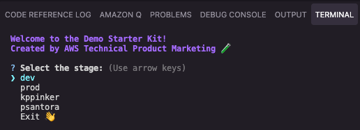

<!-- @export {"id": "kit", "deleteFile": true} -->

# Demo Starter Kit Documentation

This documentation will walk you through how the Demo Starter Kit works in depth so you can better leverage and/or customize its functionality.

[TOC]

## Configuration File

The starter kit uses [`cdk.json`](../../cdk.json) to centrally track and manage CDK configurations.

```json
{
    "projectId": "PROJECT-IDENTIFIER",
    "accounts": {
        "staging": {
            "id": "AWS_ACCOUNT_ID",
            "region": "AWS_REGION",
            "midway": true
        },
        "prod": {
            "id": "AWS_ACCOUNT_ID",
            "region": "AWS_REGION",
            "midway": true,
            "prod": true
        },
        "ALIAS_1": {
            "id": "AWS_ACCOUNT_ID",
            "region": "AWS_REGION",
            "midway": true
        },
        "ALIAS_2": {
            "id": "AWS_ACCOUNT_ID",
            "region": "AWS_REGION"
        }
        // more aliases if needed
    }
}
```

### Project Identifier

The **projectId** property must be less than 15 characters long and not use any special characters other than `-`. It serves as a unique project identifier for:

- Creating a prefix for stack names and generated resource names, supporting multiple demo deployments in the same account.
- Tagging all CDK resources in the project.

<!-- @export {"deleteLines": 8} -->

- Linking Federate profiles to the Amazon Cognito domain URL.
    - See the [Federate constructs](#federate-constructs) for more context.

### Midway

Setting **midway** to `true` enables [Federate/Midway authentication](https://integ.ep.federate.a2z.com/help), allowing Amazon employees to access the demo in that account. You can also use Federate to limit access to your demo to particular teams and/or users.

## Kit CLI

The starter kit comes packaged with a CLI that provides a set of options to help facilitate local development.

Run the command `npm install` from the root directory beforehand.

```bash
npm run kit
```



The kit CLI can also be used in headless mode by directly providing the operation, stage, and, if applicable, option(s) as command line arguments.

```bash
npm run kit -- --help
```

See [kit.ts](../../tools/kit.ts) for more context.

### Configure Credentials

This operation will configure credentials using AWS Developer Account (ADA), IAM Identity Center, or short-term credentials.

- Profiles are created with the naming convention `{stage}-{projectId}`.

```bash
npm run kit -- configure-credentials [stage] [option]
```

#### Option

- `-m`, `--method`: Credential method (AWS Developer Account, IAM Identity Center, Short-term Credentials)

### Default Credentials

This operation will copy the selected account's credentials profile to the default credentials profile.

- Useful for running AWS CLI commands without specifying a profile.

```bash
npm run kit -- default-credentials [stage]
```

### Configure Secret

This operation will help you configure an [AWS Secrets Manager](https://docs.aws.amazon.com/secretsmanager/latest/userguide/intro.html) secret in the selected account.

- The secret name you provide is prefixed with the stage and project ID in the CDK configuration file.

```bash
npm run kit -- configure-secret [stage] [options]
```

#### Options

- `-n`, `--name`: Secret name/ID
- `-v`, `--value`: Secret value

### Bootstrap Account

This operation will bootstrap the selected account in the region configured and `us-east-1` as well as enable termination protection for prod accounts.

```bash
npm run kit -- bootstrap [stage]
```

### Synthesize CDK Stacks

This operation will validate your CDK code and check for [CDK NAG](https://github.com/cdklabs/cdk-nag) errors/warnings.

- The CLI will transparently output the stack building process, Docker invocations, etc. to keep you informed.

```bash
npm run kit -- synth [stage]
```

### Deploy CDK Stack(s)

This operation will deploy your CDK code to the selected account.

- If you elect to not just deploy all stacks, the operation will allow you to select exactly which stacks you would like to deploy to the selected account.

* Stack dependencies will also be deployed alongside the selected stacks to ensure functionality.
* The operation uses the `--concurrency` flag to deploy stacks in parallel for faster deployment.

```bash
npm run kit -- deploy [stage] [option]
```

#### Option

- `--all`: Deploy all stacks without prompting

### Hotswap CDK Stack(s)

This operation is similar to the [previous operation](#deploy-cdk-stacks), but it performs a faster, hotswap deployment if possible. See the [documentation](https://docs.aws.amazon.com/cdk/v2/guide/ref-cli-cmd-deploy.html#ref-cli-cmd-deploy-options) for more details.

```bash
npm run kit -- hotswap [stage] [option]
```

#### Option

- `--all`: Hotswap all stacks without prompting

### Deploy Frontend Stack

This operation deploys the [frontend deployment stack](../../lib/stacks/frontend/index.ts) by itself using the `-e` flag for quicker deployment.

- It first builds the frontend to ensure there are no errors.

```bash
npm run kit -- deploy-frontend [stage]
```

### Refresh Frontend Environment

This operation is invoked by the [next operation](#test-frontend-locally) automatically, but it can also be run by itself if you just want to:

- Update the `.env` file in the frontend source folder with the environment variables from the CDK backend.
- If a Graph API ID is present, generate GraphQL files.

```bash
npm run kit -- refresh-frontend [stage]
```

### Test Frontend Locally

This operation will [refresh the local environment](#refresh-local-environment) then output a link to a [local server](http://localhost:3000/) for testing changes to your frontend React app.

- Assuming there are no breaking changes, you should be able to see your changes reflected in the terminal and browser immediately.
- After you **press enter to continue**, the operation will kill the local server so future changes don't clutter the terminal.

### Manage Cognito User

This operation will get the user pool ID from the `.env` file then give you the option to create or delete a Cognito user in that user pool.

- When creating a user, you will be asked to enter an email address. A temporary password will be emailed to this address, enabling you to log in to the frontend application.

    
    - You can use the **Reset Password** option to set a new password for the user if needed.
    - Note that you cannot delete Amazon Federate users.

### Destroy CDK Stack(s)

This operation will destroy your stacks in the selected account.

- Use this operation with **_extreme caution_** as the CDK stacks destroyed with this operation cannot be recovered and may leave your application broken when using dependent stacks.
- There are certain limitations with this operation due to how CDK is designed:
    - Stacks that are destroyed are still listed because the CDK uses the local `cdk.out` manifest, unlike [Pulumi](https://www.pulumi.com/blog/aws-cdk-on-pulumi/) which retains a cloud referenced stack list.
    - We recommend that you delete the stacks in accordance with their dependencies in [stage.ts](../../lib/stage.ts).
    - This operation may not destroy certain cloud resources such as WAF ACLs, S3 buckets, Secrets Manager secrets, etc. Manually delete these resources in the AWS Management Console.

<!-- @export {"deleteLines": 50} -->

## Export CLI

```bash
npm run export -- --id kit
```

Creates a ZIP archive `export.zip` by processing `@export` directives in your files to remove sensitive/internal code.

### Directives

- Typescript

    ```typescript
    // @export {"deleteLines": 0}
    // @export {"id": "kit", "deleteLines": 4}
    ```

- Markdown

    ```markdown
    <!-- @export { "replace": "sensitive-value", "with": "placeholder" } -->
    <!-- @export { "id": "kit", "deleteFile": true } -->
    ```

- JSON

    ```json
    {
        "@export": { "deleteLines": 0 }
    }
    ```

- YAML

    ```yaml
    # @export {"deleteLines": 0}
    ```

### Options

- `id: string` - Only process this tag when a matching ID is specified via repeatable `--id` flag.
- `deleteFile: true` - Remove entire file.
- `deleteLines: number` - Remove directive and the following number of lines.
- `replace/with` - Remove directive and replace text.

### Defaults

The tool automatically removes:

- The export ZIP file
- The export script `tools/export.ts`
- `docs/kit/images/`
- Any files matching patterns in `.gitignore`

See [export.ts](../../tools/export.ts) for more context.

## Commit CLI

```bash
npm run commit
```

The commit CLI is provided by [Commitizen](https://commitizen-tools.github.io/commitizen/). See their [documentation](https://commitizen-tools.github.io/commitizen/tutorials/writing_commits/) for more details.

### Hooks

Commit hooks, powered by [Husky](https://typicode.github.io/husky/), will run automatically after the commit CLI:

- The pre-commit hook will run code formatting and quality checks.
    - [lint-staged](https://github.com/lint-staged/lint-staged) will format and lint staged files.
        - Formatting and linting will be handled by [Prettier](https://prettier.io/) and [ESLint](https://eslint.org/) for TypeScript and [Ruff](https://docs.astral.sh/ruff/) for Python.
    - See [pre-commit](../../.husky/pre-commit), [package.json](../../package.json), [eslint.config.ts](../../eslint.config.ts), and [.prettierrc](../../.prettierrc) for more context.

## CDK Constructs

<!-- @export {"deleteLines": 3} -->

Some aspects of the starter kit infrastructure are specific to internal Amazon authentication/security requirements. Use the [export CLI](#export-cli) to remove the [Federate constructs](#federate-constructs) before sharing publicly.

### App

`bin/app.ts` is the CDK entrypoint as configured in [cdk.json](../../cdk.json).

The stack prefix and stage for the app are determined by a context variable passed by the [kit CLI](#kit-cli). The account details are determined by the `cdk.json` file itself.

See [bin/app.ts](../../bin/app.ts) for more context.

<!-- @export {"deleteLines": 14} -->

### Federate Constructs

These custom constructs set the necessary properties for creating a Federate-compatible Cognito User Pool and User Pool Client.

- The Federate secret is imported from AWS Secrets Manager.
    - The stage determines which secret and issuer URL is used.
- The project identifier is used as the **clientId** and as a prefix in the User Pool Domain URL to align with the [redirect URIs we set up in Federate](./demo-creation.md#federate-profiles).
- Callback URLs reference the CloudFront distribution and `http://localhost:3000` for local development.

You can simply replace the standard `UserPool` construct with `FederateUserPool` and the standard `UserPoolClient` construct with `FederateUserPoolClient` to add Midway authorization.

See [federate.ts](../../lib/common/constructs/federate.ts) for more context.
