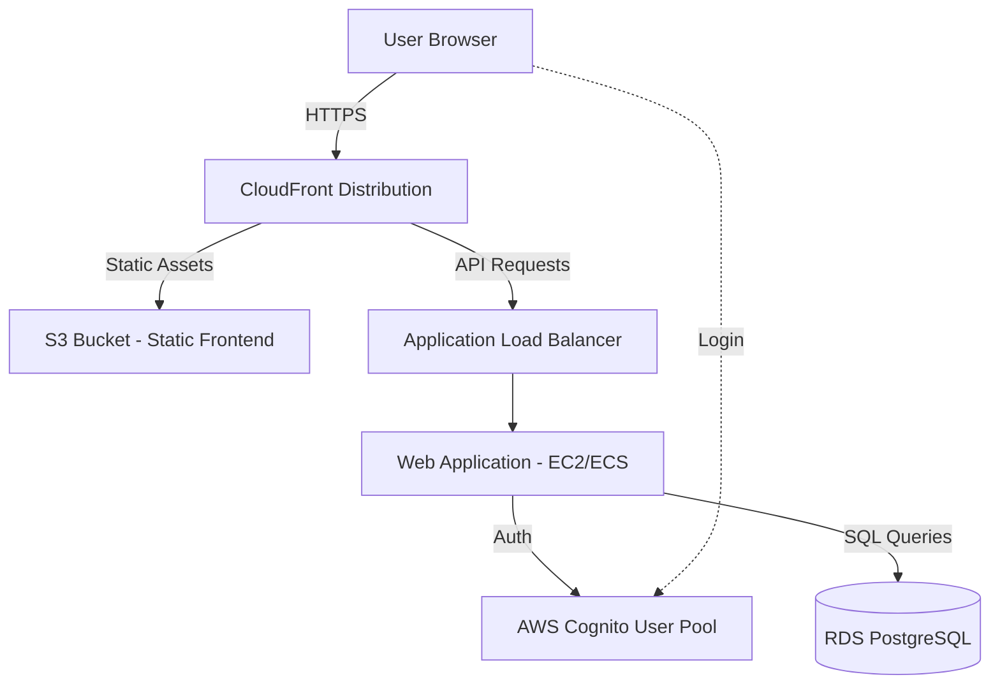

# Design Document: AWS Security Agent Demo Application

## Overview

This design describes an educational web application that demonstrates AWS Security Agent's penetration testing capabilities. The application intentionally contains three critical security vulnerabilities (SQL Injection, Command Injection, and Cross-Site Scripting) with educational messages to help users understand how these attacks work and how AWS Security Agent detects them.

The architecture follows a simple three-tier pattern:
- **Presentation Layer**: Static web frontend served through CloudFront
- **Application Layer**: Backend API with intentional vulnerabilities
- **Data Layer**: RDS PostgreSQL database

The application is designed to be as simple as possible while effectively showcasing AWS Security Agent's detection capabilities.

## Architecture

### High-Level Architecture



### Component Responsibilities

1. **CloudFront Distribution**: CDN entry point, serves static assets from S3 and proxies API requests to ALB
2. **S3 Bucket**: Hosts static HTML/CSS/JavaScript frontend files
3. **Application Load Balancer**: Routes traffic to application instances
4. **Web Application**: Node.js/Express backend with intentional vulnerabilities
5. **Cognito User Pool**: Manages user authentication and sessions
6. **RDS PostgreSQL**: Stores application data (user profiles, comments, etc.)

### Infrastructure Components

**CloudFront Configuration**:
- Origin 1: S3 bucket for static assets (path pattern: `/assets/*`, `/index.html`)
- Origin 2: ALB for API requests (path pattern: `/api/*`)
- HTTPS only with AWS-managed certificate
- Default cache behavior for static assets

**Application Deployment**:
- Single EC2 instance or ECS Fargate task (for simplicity)
- Node.js 18+ runtime
- Express.js web framework
- No auto-scaling (demo purposes only)

**RDS Configuration**:
- PostgreSQL 15
- Single-AZ deployment (demo purposes)
- db.t3.micro instance
- Public accessibility disabled
- Security group allows access only from application

**Cognito Configuration**:
- User pool with username/password authentication
- No MFA (for simplicity)
- Pre-populated with demo users
- JWT tokens for session management

## Components and Interfaces

### Frontend Application

**Technology**: Vanilla HTML, CSS, JavaScript (no frameworks for simplicity)

**Pages**:
1. **Login Page** (`/login.html`): Cognito authentication form
2. **Dashboard** (`/dashboard.html`): Main page with vulnerability demos
3. **Profile Page** (`/profile.html`): User profile with SQL injection demo
4. **Comments Page** (`/comments.html`): Comment system with XSS demo
5. **Tools Page** (`/tools.html`): System tools with command injection demo

**Educational UI Elements**:
Each vulnerable feature includes:
- Vulnerability name and description
- Sample attack payloads in a collapsible section
- "Try it yourself" instructions
- Success/failure feedback messages

### Backend API

**Technology**: Node.js with Express.js

**API Endpoints**:

```
POST /api/auth/login
- Authenticates with Cognito
- Returns JWT token

GET /api/profile/:userId
- Vulnerable to SQL injection
- Returns user profile data
- Educational message on successful exploit

POST /api/comments
- Vulnerable to XSS (stored)
- Stores comment in database
- No input sanitization

GET /api/comments
- Returns all comments
- Renders without encoding

POST /api/tools/ping
- Vulnerable to command injection
- Executes system ping command
- Educational message on successful exploit

GET /api/health
- Preflight validator endpoint
- Checks RDS connectivity, Cognito config
```

### Preflight Validator

**Purpose**: Validates infrastructure setup before testing

**Checks**:
1. RDS database connectivity
2. Cognito user pool configuration
3. S3 bucket accessibility
4. Application health

**Implementation**: `/api/health` endpoint returns JSON with status of each component

```javascript
{
  "status": "healthy",
  "checks": {
    "database": "connected",
    "cognito": "configured",
    "s3": "accessible"
  }
}
```

## Data Models

### User Profile (RDS Table: `users`)

```sql
CREATE TABLE users (
  id SERIAL PRIMARY KEY,
  cognito_id VARCHAR(255) UNIQUE NOT NULL,
  username VARCHAR(100) NOT NULL,
  email VARCHAR(255) NOT NULL,
  role VARCHAR(50) DEFAULT 'user',
  bio TEXT,
  created_at TIMESTAMP DEFAULT CURRENT_TIMESTAMP
);
```

### Comments (RDS Table: `comments`)

```sql
CREATE TABLE comments (
  id SERIAL PRIMARY KEY,
  user_id INTEGER REFERENCES users(id),
  content TEXT NOT NULL,
  created_at TIMESTAMP DEFAULT CURRENT_TIMESTAMP
);
```

### Educational Messages (RDS Table: `vulnerability_info`)

```sql
CREATE TABLE vulnerability_info (
  id SERIAL PRIMARY KEY,
  vuln_type VARCHAR(50) NOT NULL,
  title VARCHAR(255) NOT NULL,
  description TEXT NOT NULL,
  sample_payloads JSONB NOT NULL,
  detection_info TEXT NOT NULL
);
```

Sample data:
```json
{
  "vuln_type": "sql_injection",
  "title": "SQL Injection Vulnerability",
  "description": "This endpoint constructs SQL queries by concatenating user input directly into the query string without parameterization...",
  "sample_payloads": [
    "' OR '1'='1",
    "admin' --",
    "' UNION SELECT * FROM users --"
  ],
  "detection_info": "AWS Security Agent detects SQL injection by analyzing query patterns and testing various injection payloads..."
}
```

## Correctness Properties


*A property is a characteristic or behavior that should hold true across all valid executions of a system—essentially, a formal statement about what the system should do. Properties serve as the bridge between human-readable specifications and machine-verifiable correctness guarantees.*

### Property 1: Reflected XSS renders unsanitized input

*For any* user input provided to the application, when that input is reflected in an HTTP response, the application should render it directly in the HTML without sanitization or encoding.

**Validates: Requirements 4.1**

### Property 2: Stored XSS persists and renders unsanitized

*For any* user input stored in the database, when that content is retrieved and displayed, the application should render it without HTML encoding, allowing script execution.

**Validates: Requirements 4.2**

### Property 3: DOM-based XSS executes client-side scripts

*For any* user input that affects DOM manipulation through client-side JavaScript, the application should execute scripts without validation.

**Validates: Requirements 4.3**

### Property 4: Attribute-based XSS allows injection

*For any* user input placed in HTML attributes, the application should allow script execution through attribute injection techniques.

**Validates: Requirements 4.4**

### Property 5: Command injection executes arbitrary commands

*For any* user input passed to system command execution functions, the application should execute the commands without input sanitization, allowing arbitrary command execution.

**Validates: Requirements 5.1, 5.2**

### Property 6: SQL injection allows query manipulation

*For any* user input included in SQL queries, the application should construct queries through string concatenation without parameterization, allowing SQL syntax injection for authentication bypass and data extraction.

**Validates: Requirements 6.1, 6.2, 6.3, 6.4**

### Property 7: Educational messages display on exploit

*For any* successful vulnerability exploit (XSS, command injection, or SQL injection), the application should display an educational message explaining the vulnerability type and detection method.

**Validates: Requirements 4.5, 5.3, 6.5**

## Error Handling

### Intentional Lack of Error Handling

Since this is a deliberately vulnerable application, error handling is intentionally minimal to expose vulnerabilities:

1. **SQL Errors**: Database errors are returned directly to the client, revealing schema information
2. **Command Errors**: System command errors are displayed with full output
3. **Input Validation**: No input validation or sanitization is performed

### Educational Error Messages

When vulnerabilities are successfully exploited, the application provides educational feedback:

```javascript
{
  "success": true,
  "message": "🚨 Oh no! SQL Injection Detected!",
  "educational": {
    "vulnerability": "SQL Injection",
    "what_happened": "Your input was directly concatenated into the SQL query without parameterization...",
    "how_agent_detects": "AWS Security Agent detects this by testing various SQL injection payloads and analyzing query patterns...",
    "sample_payloads": ["' OR '1'='1", "admin' --"]
  },
  "data": { /* actual query results */ }
}
```

### Preflight Validation Errors

The preflight validator provides clear error messages for infrastructure issues:

```javascript
{
  "status": "unhealthy",
  "checks": {
    "database": {
      "status": "failed",
      "error": "Connection timeout to RDS instance"
    },
    "cognito": {
      "status": "ok"
    }
  }
}
```

## Testing Strategy

### Dual Testing Approach

This application requires both unit tests and property-based tests:

**Unit Tests**: Verify specific examples, infrastructure setup, and integration points
- Test Cognito authentication with valid/invalid credentials
- Test preflight validator with healthy/unhealthy infrastructure
- Test educational message content and formatting
- Test API endpoint responses

**Property Tests**: Verify vulnerabilities work across all inputs
- Test XSS vulnerabilities with various payloads
- Test command injection with different command structures
- Test SQL injection with various injection techniques
- Test educational message display on any successful exploit

### Property-Based Testing Configuration

**Library**: We'll use `fast-check` for Node.js property-based testing

**Configuration**:
- Minimum 100 iterations per property test
- Each test tagged with feature name and property number
- Tag format: `Feature: vulnerable-demo-app, Property {N}: {description}`

**Example Property Test Structure**:

```javascript
// Feature: vulnerable-demo-app, Property 1: Reflected XSS renders unsanitized input
test('XSS payloads are rendered without sanitization', async () => {
  await fc.assert(
    fc.asyncProperty(
      fc.string(), // Generate random strings including XSS payloads
      async (userInput) => {
        const response = await request(app)
          .get(`/api/search?q=${encodeURIComponent(userInput)}`);
        
        // Verify input is rendered directly without encoding
        expect(response.text).toContain(userInput);
      }
    ),
    { numRuns: 100 }
  );
});
```

### Infrastructure Testing

**Deployment Validation**:
- Verify CloudFront distribution is created and accessible
- Verify RDS instance is provisioned and connectable
- Verify Cognito user pool is configured
- Verify S3 bucket serves static assets
- Verify ALB routes to application

**Preflight Validator Testing**:
- Test validator detects healthy infrastructure
- Test validator detects database connectivity issues
- Test validator detects Cognito configuration problems
- Test validator reports specific error messages

### Security Testing with AWS Security Agent

The application is designed to be tested with AWS Security Agent, which should detect:

1. **SQL Injection**: Agent should discover authentication bypass and data extraction
2. **Command Injection**: Agent should discover arbitrary command execution
3. **XSS**: Agent should discover reflected, stored, DOM-based, and attribute-based XSS
4. **Educational Value**: Agent's findings should align with the educational messages displayed

## Implementation Notes

### Technology Choices

**Backend**: Node.js with Express.js
- Simple and widely understood
- Easy to create intentional vulnerabilities
- Good ecosystem for testing libraries

**Frontend**: Vanilla HTML/CSS/JavaScript
- No framework complexity
- Easy to understand for learners
- Direct DOM manipulation for XSS demos

**Database**: PostgreSQL on RDS
- Widely used relational database
- Good for SQL injection demonstrations
- AWS-managed for simplicity

**Infrastructure as Code**: AWS CDK (TypeScript)
- Automated deployment with AWS CDK
- Repeatable infrastructure
- Easy to tear down and recreate
- Type-safe infrastructure definitions

### Deployment Considerations

**Cost Optimization**:
- Use smallest instance sizes (t3.micro, db.t3.micro)
- Single-AZ deployment
- No auto-scaling
- Consider using AWS Free Tier where possible

**Security Warnings**:
- This application is intentionally vulnerable
- Should only be deployed in isolated test environments
- Should not be accessible from public internet without proper controls
- Should include clear warnings in UI and documentation

**Demo Data**:
- Pre-populate database with sample users and comments
- Include sample vulnerability payloads in UI
- Provide test credentials for Cognito

### Educational Content

Each vulnerability page should include:

1. **Vulnerability Description**: Clear explanation of the security issue
2. **Why It's Dangerous**: Real-world impact and risks
3. **Sample Payloads**: Copy-paste examples to try
4. **How AWS Security Agent Detects It**: Explanation of detection methodology
5. **How to Fix It**: Brief guidance on proper mitigation (parameterized queries, input sanitization, etc.)


